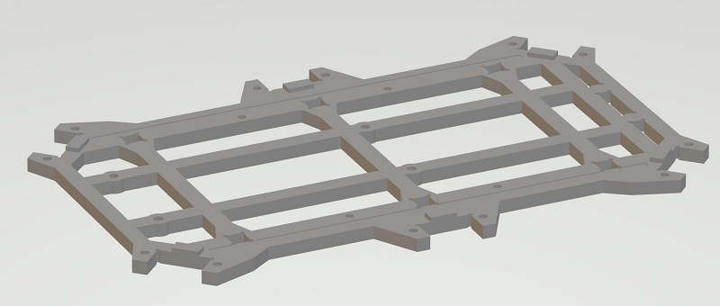
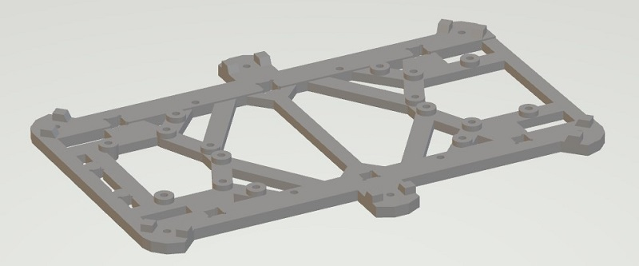
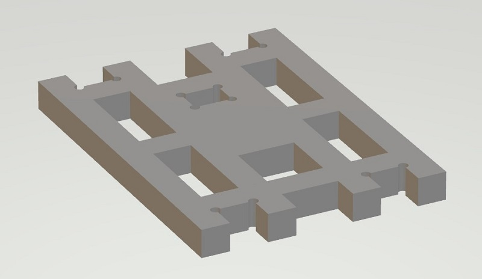
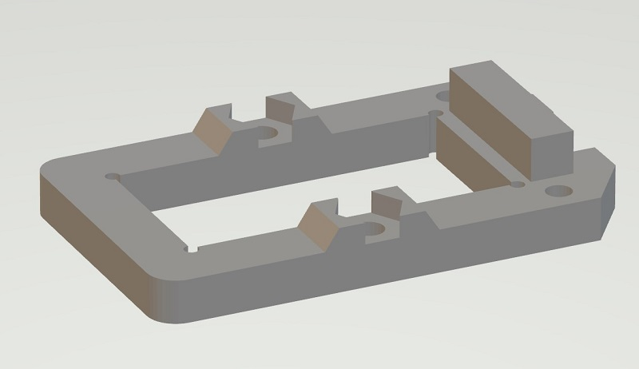
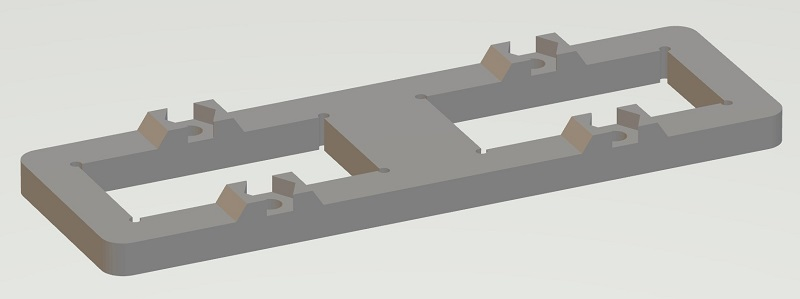
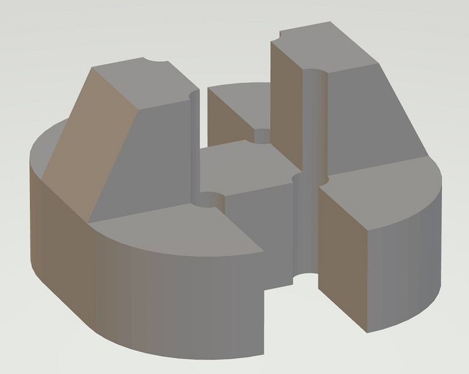
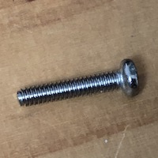
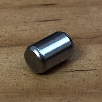

#  Hexapod

A Hexapod Robot using Raspberry Pi Zero W

## Introduction

This is a hexapod robot based on [Smallp Tsai](https://github.com/SmallpTsai)'s [hexapod-v2-7697](https://github.com/SmallpTsai/hexapod-v2-7697) project.
This project reused most of the mechanism design in the original project, but with a totally redesign on the circuits and softwares.
The table below shows the difference between this project and the original one.

|                 | Original hexapod-v2-7697 | This project                                    |
| --------------- | ------------------------ | ----------------------------------------------- |
| Controller      | Linkit 7697              | Raspberry Pi Zero W or Raspberry Pi Zero W 2    |
| PWM control     | Custom circuit board     | 2 x PCA9685 motor driver boards                 |
| DC-DC           | 7 x mini360 modules      | 2 x XL4005 5A Max DC-DC modules and 1 x mini360 |
| Power           | 2S Lipo battery          | 2 x 18650 batteries                             |
| Remote          | BLE                      | WiFi                                            |
| Remote software | Android and iOS          | PC, Android (WIP)                               |

## Mechanism

### Bill of Materials

#### Servo - MG92B

Servo is the key component. I use TowerPro [MG92B](http://www.towerpro.com.tw/product/mg92b/). It has metal gear (important!).
An hexapod requires 18 of them.

>    The dimension of 3d printed part is highly depended on servo's dimension. 
>    Modification is required if you want to use other alternative servo. 

>    TowerPro MG92B can be found on Ebay seller [servohorns959](https://www.ebay.com/usr/servohorns959), which is listed on TowerPro official website ([Link] (http://www.towerpro.com.tw/about-us-2/)).  I also got mime servo from him.

#### 3D-Printed Parts

##### Body x 1

Filename | Thumbnail | Required |
-------- | --------- | -------- |
body_top |  | 1 |
body_bottom |  | 1 |
body_center |  | 1 |
body_side_wall |  | 2 |
body_back_wall |  | 1 |

##### Leg x 6

Filename | Thumbnail | Required |
-------- | --------- | -------- |
thigh_top |  | 1 (x6) |
thigh_bottom |  | 1 (x6) |
joint_cross |  | 1 (x6) |
joint_top |  | 2 (x6) |
joint_bottom |  | 2 (x6) |
leg_top |  | 1 (x6) |
let_bottom |  | 1 (x6) |
foot_top |  | 1 (x6) |
foot_bottom |  | 1 (x6) |
foot_ground |  | 1 (x6) |
foot_tip |  | 1 (x6) |

#### Others

Name | Spec | Thumbnail | Required | Note
---- | ---- | --------- | -------- | ----
Screw | M2 6mm |  | 54 | Servo Arm: 1 x 18 Joint: 4 x 6 Thigh: 2 x 6
Screw | M2 10mm |  | 24 | Thigh: 1 x 6 Pin lock: 1 x 18
Screw | M2 30mm |  | 36 | Servo: 2 x 18
Nuts | M2 |  | 36 | Servo: 2 x 18
Pin (304) | M4 6mm |  | 18 | Servo: 1 x 18

### Leg Assemble

Please check [Leg Assemble](LEG.md) for more detail instructions

Leg assembly instruction video https://youtu.be/oaAE5fC09KQ is also available.

> Note. Total 6 Legs are required.

## Skill requirement

If you want to make one hexapod by yourself. You should at least knows how to:

* Mechanism part
  * Use `3D printer` to print a model.
  * Able to adjust 3D model to fit your custom need.
* Electronics
  * Make a `PCB` (suggest to use professional PCB services)
  * Soldering `SMD` component (0805 and TSSOP28)
  * How to use/charge/store `LIPO batteries`
* Software
  * Use `Linkit 7697` (ie. upload and run any program)
  * Use `LRemote` to communicate 7697 and your mobile phone

## Table of Content

1. [Mechanism](mechanism/) - How to build the body
1. [Electronics](electronics/) - Circuit explanation
1. [Software](software/) - The software running on Linkit 7697
